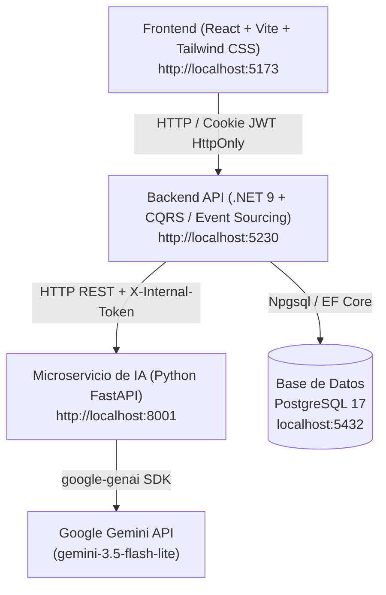

# Plataforma de Gamificación Educativa con IA — PFC

Sistema web de gamificación educativa con generación de contenido asistida por IA bajo un esquema **HITL** (Human-in-the-Loop): la IA propone, el docente decide. Desarrollado como Proyecto Final de Carrera (Licenciatura en Sistemas de Información, FaCENA-UNNE).

Todo este README está construido en base a el primer prototipo y sus commits, lo actualizaré cuando considere que cambió lo suficiente o cuando esté listo para un deploy

---

## Arquitectura del Sistema



| Capa | Stack |
|------|-------|
| **Frontend** | React 18, Vite, Tailwind CSS v4, React Query, Zustand, Framer Motion, Anime.js |
| **Backend** | .NET 9 WebAPI, EF Core, Npgsql, CQRS (MediatR), Event Sourcing |
| **Microservicio IA** | Python 3.11+, FastAPI, Uvicorn, `google-genai` SDK |
| **Infraestructura** | Docker Compose, PostgreSQL 17 |

---

## Requisitos Previos

1. **Docker Desktop** (o Docker Engine + Compose v2+)
2. **.NET 9 SDK** — [descargar](https://dotnet.microsoft.com/download/dotnet/9.0)
3. **Node.js v18+** con `npm` — [descargar](https://nodejs.org/)
4. **Python 3.11+** — [descargar](https://www.python.org/)
5. Una **API Key de Google Gemini** — generala en [Google AI Studio](https://aistudio.google.com/) (gratuita)
6. **dotnet-ef** como herramienta global: `dotnet tool install --global dotnet-ef` (si no lo tenés ya)

---

## Guía de Instalación

### 1 — Variables de entorno

```bash
# Raíz del proyecto — PostgreSQL (usado por docker-compose.yml)
cp .env.example .env

# Microservicio de IA
cp ai-service/.env.example ai-service/.env
# Editá ai-service/.env: GEMINI_API_KEY real, y TOKEN_INTERNO_BACKEND con un
# string aleatorio propio (no un valor de ejemplo).

# Backend .NET
cp backend/WebApi/appsettings.Development.json.example backend/WebApi/appsettings.Development.json
# Editá ConnectionStrings y AiService:TokenInterno con tus valores locales.
```

> **El `TOKEN_INTERNO_BACKEND` de `ai-service/.env` y `AiService:TokenInterno`
> de `appsettings.Development.json` deben ser exactamente el mismo string.**
> Si no coinciden, el microservicio de IA rechaza los pedidos del backend con 401.

**El secreto del JWT no va en ningún archivo del repositorio — va en `dotnet user-secrets`:**

```bash
cd backend/WebApi
dotnet user-secrets init
dotnet user-secrets set "JwtSettings:Secret" "un-string-aleatorio-largo-y-propio-no-un-ejemplo"
cd ../..
```

Sin este paso, el backend arranca pero cualquier intento de login falla con
un error de configuración — es intencional, el sistema no arranca con un
secreto por defecto.

---

### 2 — Base de datos (PostgreSQL vía Docker)

```bash
docker compose up -d
docker compose ps   # confirmá que el estado sea "healthy", no solo "running"
```

---

### 3 — Aplicar las migraciones (paso manual, no automático)

El sistema **no** aplica migraciones solo al arrancar — es una decisión
deliberada para no tener dos caminos distintos escribiendo el esquema (uno
manual y revisado, otro automático y silencioso). Hay que correrlo una vez:

```bash
cd backend
dotnet ef database update --project Infrastructure --startup-project WebApi
cd ..
```

---

### 4 — Microservicio de IA (Python FastAPI)

```bash
cd ai-service

python -m venv venv

# Windows PowerShell
.\venv\Scripts\activate
# Linux / macOS
source venv/bin/activate

pip install -r requirements.txt
uvicorn main:app --reload --port 8001
```

Disponible en `http://localhost:8001`.

---

### 5 — Backend (.NET 9 WebAPI)

```bash
cd backend/WebApi
dotnet run
```

La WebAPI inicia en `http://localhost:5230`. En entorno `Development`
**siembra los datos de prueba automáticamente** (eso sí es automático — lo
que no lo es son las migraciones del paso 3, que tienen que estar aplicadas
antes de este paso o el seed falla contra tablas inexistentes).

Documentación interactiva de la API (Scalar): `http://localhost:5230/scalar`
(`/scalar/v1` también funciona, apunta al mismo documento explícitamente).

---

### 6 — Frontend (React + Vite)

```bash
cd frontend
npm install
npm run dev
```

`http://localhost:5173`.

> Si el frontend usa un proxy de Vite hacia el backend (en vez de llamar a
> `http://localhost:5230` directo con `credentials: 'include'`), confirmá
> que sea consistente con lo que espera el backend: el CORS ya está
> configurado para aceptar `http://localhost:5173` como origen directo. Si
> hay proxy Y CORS a la vez sin que las rutas relativas coincidan en los
> dos lados, las cookies de sesión pueden comportarse distinto de lo
> esperado. Ver `spec.md` para el contrato completo.

---

## Credenciales de Desarrollo (Seed)

| Rol | Correo | Contraseña |
|-----|--------|------------|
| Docente | `docente@unne.edu.ar` | `Cambiar123!` |
| Alumno | `joel@alumno.unne.edu.ar` | `Cambiar123!` |
| Directivo | `directivo@unne.edu.ar` | `Cambiar123!` |
| Administrador | `admin@unne.edu.ar` | `Cambiar123!` |

El **código de invitación** del aula de prueba se muestra en el Dashboard
del Docente una vez iniciada la sesión.

> Exclusivamente para desarrollo local. No usar en producción — y el uso de
> estas credenciales en particular no reemplaza la revisión de propiedad
> intelectual y confidencialidad descrita en el Capítulo 4 del informe.

---

## Solución de Problemas

**Error 401 en el Microservicio de IA**
`TOKEN_INTERNO_BACKEND` (ai-service/.env) y `AiService:TokenInterno`
(appsettings.Development.json) no coinciden.

**El login falla con un error de configuración**
Falta correr `dotnet user-secrets set "JwtSettings:Secret" "..."` — ver
sección de instalación, paso 1.

**El seed no crea nada / tira error al arrancar el backend**
Las migraciones no se aplicaron. Correr el paso 3 antes que el paso 5.

**Error de conexión a PostgreSQL**
`docker compose ps` — confirmar `healthy`, no solo `running`. Si cambiaste
la contraseña en `.env`, actualizarla también en la cadena de conexión de
`appsettings.Development.json`.

**El frontend no conecta con el backend**
Confirmar que el backend esté corriendo en el puerto 5230, y que las
llamadas del frontend usen `credentials: 'include'` (ver nota del paso 6).

**La IA no genera misiones / Error 500 en `/generar-con-ia`**
Microservicio de IA activo en el puerto 8001, `GEMINI_API_KEY` válida.

---

## Estructura del Repositorio

```text
GamificacionPFC/
├── ai-service/              # Microservicio Python (FastAPI + Gemini SDK)
├── backend/                 # Solución .NET 9 (Clean Architecture / CQRS)
│   ├── Core.Domain/         # Agregados y eventos de dominio
│   ├── Core.Application/    # Comandos, Queries y Proyecciones (MediatR)
│   ├── Infrastructure/      # Persistencia EF Core y cliente HTTP IA
│   ├── WebApi/              # Endpoints REST e inyección de dependencias
│   └── Core.Domain.Tests/   # Tests unitarios del dominio
├── frontend/                 # Aplicación React + Vite + Tailwind CSS
├── docs/                     # documentos de referencia
├── docker-compose.yml
└── README.md
```

---

## Licencia y propiedad intelectual

Proyecto académico — FaCENA, UNNE. La titularidad de los derechos
patrimoniales sobre el desarrollo sigue el régimen proporcional del
Art. 7 de la Res. N° 2024-615-CS (no una licencia de código abierto
estándar) — ver Capítulo 4 del informe para el análisis completo antes de
asumir cualquier uso comercial de este repositorio.
